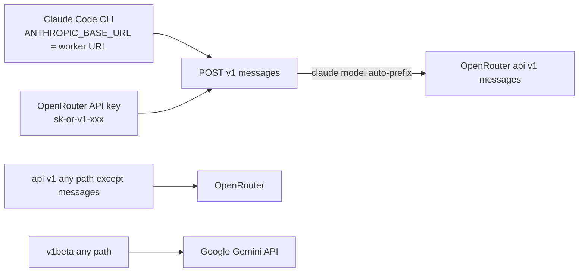

# Claude Code Router


```mermaid
flowchart LR
    A[Claude Code CLI\nANTHROPIC_BASE_URL = worker URL] --> B[POST v1 messages]
    C[OpenRouter API key\nsk-or-v1-xxx] --> B
    B -->|claude model auto-prefix| D[OpenRouter api v1 messages]

    E[api v1 any path except messages] --> F[OpenRouter]
    G[v1beta any path] --> H[Google Gemini API]
```

```bash
export ANTHROPIC_BASE_URL="https://<worker>"
export ANTHROPIC_API_KEY="sk-or-v1-..."
```
